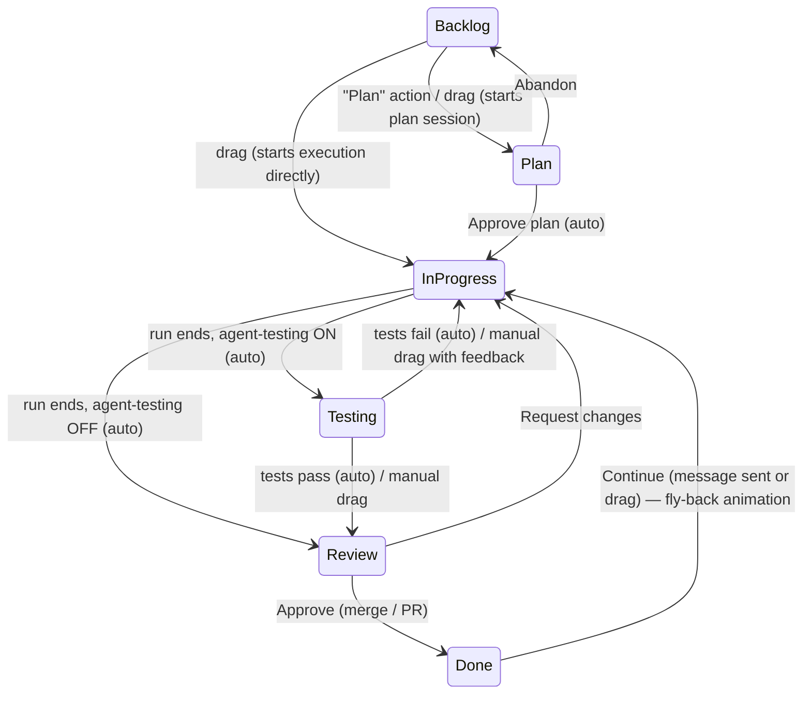

<!--
Provenance: produced 2026-08-27/29 by a multi-agent design workflow driven by
Claude Code, verified against `claude` CLI v2.1.231, live docs, and on-disk
session stores on the primary dev machine. Working name "Maestro" has been
renamed to "Overture" throughout.

Where this document conflicts with 00-resolutions.md, the resolutions win.
Claims tagged [assumed] must be proven or refuted by the M0 spike before code
depends on them.
-->

# Overture — Kanban Mechanics, Card Lifecycle & Product Behavior Spec

## 1. Core model in one paragraph

A **card** is a ticket that owns exactly one **primary conversation thread** with Claude Code (a chain of one CC session resumed over time), plus zero or more attached **test runs** (separate short-lived sessions). The card's **column** is derived from its lifecycle state; a **runtime sub-state** (idle, planning, awaiting-approval, running, needs-input, queued, interrupted, error) is orthogonal to the column and drives the card's live visuals. Drags are **commands, not bookkeeping**: dragging a card somewhere *causes* the thing that column means, or the drag is rejected with a bounce-back and an explanatory toast.

---

## 2. Card state machine

### 2.1 Columns and sub-states

| Column | Meaning | Possible sub-states |
|---|---|---|
| **Backlog** | Ticket exists, no work started (or work abandoned before any diff) | `idle`, `drafting` (Claude authoring assist active) |
| **Plan** | A CC session in plan mode is producing or has produced a plan | `planning` (streaming), `awaiting-approval`, `needs-input`, `interrupted`, `error` |
| **In Progress** | Execution session running, queued, or paused mid-work | `running`, `queued` (single-dir mode), `needs-input`, `interrupted`, `error`, `idle` (run ended, user chose to keep working here) |
| **Testing** | Card is being verified — by an agent test run or by the user in the preview pane | `testing-running` (agent), `manual` (user testing), `needs-input`, `error` |
| **Review** | Work complete; human reads diff + final message and decides | `idle`, `tests-failed` (arrived with failing verdict), `merge-conflict` |
| **Done** | Approved; merged/PR opened (worktree mode) or accepted (single-dir) | `idle` |



### 2.2 Automatic transitions (system-triggered)

| From → To | Trigger | Notes |
|---|---|---|
| (composer) → Backlog | Ticket saved | — |
| Backlog → Plan | User taps **Plan** on card (or drags — see 2.3) | Spawns plan-mode session |
| Plan → In Progress | User taps **Approve & Start** | Same session continues with execution permissions (§6) |
| In Progress → Testing | Execution run ends with a result **and** agent-driven testing is enabled for the project (per-card override allowed) | Test session spawns immediately |
| In Progress → Review | Execution run ends and agent-driven testing is disabled | — |
| Testing → Review | Agent test run returns `pass` | Verdict + report attached |
| Testing → In Progress | Agent test run returns `fail` | Failure report attached; card enters `needs-input` with a pre-filled "fix these failures" message in the composer. If the project setting **Auto-fix on test failure** is on, the message auto-sends; max **2** fix→retest cycles, then the card goes to Review with a red `tests-failed` badge regardless. Default: auto-fix **off**. |
| Done → In Progress | User sends a message in a Done card's chat | The fly-back animation; session resumed via `--resume` |
| (any) → same column, `error`/`interrupted` | Process crash, usage limit, app-initiated interrupt | Column never changes on failure — failures are sub-states, not regressions |

**Rule decided: Testing runs *before* Review when agent-driven testing is enabled.** Rationale: Review is the human approval gate and should be the *last* gate; presenting a diff for approval before knowing whether tests pass wastes the human's attention. Review therefore always shows a test verdict (pass / fail / not run).

### 2.3 Manual drags — full matrix

Every allowed drag performs the action listed. Every rejected drag bounces back with a toast stating the reason and, where applicable, the button to press instead.

| Drag | Verdict | Meaning / reason |
|---|---|---|
| Backlog → Plan | ✅ | Starts a plan-mode session on the ticket |
| Backlog → In Progress | ✅ | Starts execution directly, skipping planning (confirm sheet appears the first time per project, with "don't ask again"). In single-dir mode with an active card, the card enters `queued`. |
| Backlog → Testing / Review / Done | ❌ | Nothing to test, review, or complete. "Won't do" is **Archive**, not Done. |
| Plan → Backlog | ✅ | Abandon: interrupts session if streaming, keeps the session archived on the card, card returns to Backlog |
| Plan → In Progress | ✅ only in `awaiting-approval` | Equivalent to Approve & Start. Rejected while the plan is still streaming ("Wait for the plan, or interrupt first"). |
| In Progress → Plan | ✅ only when not `running` | Re-enter planning: resumes the primary session with `--permission-mode plan` |
| In Progress → Backlog | ✅ only for `queued` cards | A queued card hasn't touched anything. A started card owns a worktree/diff — use Abandon in the card menu (destructive confirm, discards worktree) instead of a drag. |
| In Progress → Testing | ✅ when not `running` | Move to manual/agent testing yourself (button in the drop animation asks: "Run agent tests" / "Test manually") |
| In Progress → Review | ✅ when not `running` | Skip testing deliberately |
| In Progress → Done | ❌ | Review is the approval gate; two-step it |
| Testing → In Progress | ✅ | "It's broken" — a popover asks for a feedback message, which resumes the primary session |
| Testing → Review | ✅ | "Looks good" — manual pass; verdict recorded as `manual-pass` |
| Testing → Done | ✅ | Approve shortcut for users who tested and don't need the diff; runs the exact same Done pipeline (merge sheet, §9) |
| Review → In Progress | ✅ | Request changes (popover asks for the message) |
| Review → Testing | ✅ | Re-test |
| Review → Done | ✅ | Approve; triggers merge/PR flow |
| Done → In Progress | ✅ | Reopen: card flies back, chat composer focused |
| Done → anything else | ❌ | Reopening always goes through In Progress |
| Any drag of a card whose agent is `running` | ❌ | "Interrupt the agent first." The one exception: none. Running cards are pinned to their column. |

**Decision & justification:** drags start agents (Backlog → Plan / In Progress) rather than requiring a separate explicit Start button, because in a board where "cards move themselves," a human moving a card *must* mean something — a drag that silently lies about state (card In Progress, no agent) would destroy the board's core invariant that **column = truth**. The first-run confirm sheet protects against accidental drags without making every drag a two-step.

---

## 3. Card anatomy

### 3.1 Data model (persisted per card)

```
Card
├─ id: UUID
├─ title: String (required, ≤120 chars)
├─ body: Markdown            // the ticket: context, requirements, acceptance criteria
├─ tags: [TagID]
├─ column: Column + subState: SubState
├─ sessions: [SessionRef]    // see §4
│    └─ { ccSessionID: UUID, role: .primary | .test, startedAt, endedAt,
│         status, model, inputTokens, outputTokens, costUSD }
├─ execution
│    ├─ mode: .worktree | .singleDir   (inherited from project, frozen at start)
│    ├─ worktreePath: Path?            // .overture/worktrees/<card-slug>/
│    ├─ branch: String?                // overture/<card-slug>
│    └─ baseRef: SHA                   // merge-base (worktree) or snapshot ref (single-dir, §9.2)
├─ diffStats: { filesChanged, insertions, deletions }   // live-computed, cached
├─ prURL: URL?               // set by gh pr create
├─ deployment: { vercelURL, state: building|ready|error }?   // preview deploy for branch
├─ testResults: [TestRun]    // { sessionRef, verdict: pass|fail|manual-pass, summary, failures[], at }
├─ cost: { totalUSD, totalTokens }     // sum over sessions, incl. test runs
├─ timestamps: createdAt, startedAt?, planApprovedAt?, testedAt?, reviewedAt?, doneAt?, lastActivityAt
└─ activity: [ActivityEvent]  // append-only: transitions, runs started/ended, permission
                              // decisions, interrupts, merges, PR/deploy events, tag edits
```

Cards persist in a per-project SQLite store at `<project>/.overture/board.db` (checked into `.gitignore` by Overture on project add). Session *transcripts* are never duplicated — CC owns them in `~/.claude`; Overture stores only session IDs and derived summaries.

### 3.2 Card face (collapsed, on the board)

Top to bottom: tag pills · title · context line (varies by state: current tool action while running / plan-ready prompt / test verdict / diff stats `+214 −38 · 6 files` in Review) · footer row (branch chip, PR chip, deploy dot, cost, relative time). Cards in `needs-input` get an amber accent ring and sort to the top of their column.

### 3.3 Card detail (double-click or ⏎)

Opens as a large sheet over the board (⌘⏎ pops it into its own window). Tabs: **Chat** (primary thread, full history, composer), **Diff**, **Preview** (§8.2), **Tests**, **Activity**. Header: editable title/body/tags, session picker (§4.3), cost meter, action buttons contextual to state (Approve & Start / Interrupt / Approve → Done / etc.).

---

## 4. Session-to-card mapping

**Decision: one card = one primary thread; auxiliary runs are separate sessions attached to the card.**

- The **primary thread** is a single CC conversation carried across the card's whole life: the plan-mode session *is* the execution session *is* every later continuation, chained with `claude --resume <id>`. Full context of "why" survives from planning through the third reopen-from-Done. Overture records the session ID at spawn (`--session-id <uuid>` so the ID is known before first output).
- **Test runs** are separate sessions (role `.test`) because they need a different tool profile (run-only, no edits by default), should not pollute the primary thread's context window with test noise, and are conceptually *about* the work, not part of it. Their reports are injected into the primary thread as plain text when a fix cycle starts.
- **Ticket-authoring calls are not sessions at all** (§5).

### 4.1 Process mechanics

Every run is a child process:

```
claude -p --input-format stream-json --output-format stream-json \
  --include-partial-messages --session-id <uuid> [--resume <uuid>] \
  --permission-mode <plan | acceptEdits> --max-budget-usd <project cap> \
  [cwd = worktree or project dir]
```

Overture speaks the stream-json control protocol: tool-permission requests arrive as control requests and are answered from card UI (§7.3); interrupts are sent as control requests; follow-up user messages are written to stdin mid-run. Token/cost figures are read from result messages and accumulated onto the card.

### 4.2 Resume semantics

"Continue" from any idle state = `--resume <primary-session-id>` with the new user message. Reopening a Done card resumes the same thread. If the project's worktree was already cleaned up (§9.1), Overture recreates a worktree from the card's branch (kept until PR merge) before resuming; if the branch is gone (merged & pruned), the continuation runs against the current default branch and the card's `baseRef` is reset — the Activity feed notes "continued after merge."

### 4.3 UI

The Chat tab shows the primary thread as one continuous scroll (plan phase, execution, continuations — separated by subtle date/phase dividers). Test runs appear as collapsed inline cards at their chronological position ("Test run · fail · 3 failures ▸") that expand to the full test transcript; the session picker in the header lets you open any test session full-screen.

---

## 5. Ticket authoring with Claude (Backlog composer)

The composer (big "+" in Backlog, ⌘N) has Title, Body (markdown editor), Tags — plus a **Draft with Claude** field: type a rough prompt ("users can't paste images into comments, fix it"), hit ⌘⏎.

**Decision: authoring calls are stateless one-shot `-p` invocations, not sessions, and never become the card's session.**

```
claude -p --output-format stream-json --no-session-persistence \
  --tools "Read,Glob,Grep" --permission-mode plan \
  --max-budget-usd 0.50 \
  --json-schema '{title, body, suggestedTags[]}' \
  --append-system-prompt <ticket-writer prompt>
```

- Read-only tools are enabled so drafts are grounded in the actual codebase (file names, existing patterns), which is most of the value over a text field.
- The result streams into the composer as a replaceable preview; **Refine** sends a new one-shot containing the current draft + the refinement instruction. Statelessness is fine because the draft text *is* the state; it keeps the session model clean (no orphan mini-sessions to garbage-collect) and each call is capped at $0.50.
- Justification for "not the card's session": the execution session should start from the *finished ticket*, not from a context window half-full of drafting chatter; and tickets are often authored days before execution, when a fresh session with fresh repo state is strictly better.
- The same Draft/Refine affordance is available when editing any Backlog card's body.

---

## 6. Plan column UX

- **Enter:** "Plan" button or Backlog→Plan drag spawns the primary session with `--permission-mode plan`, prompt = ticket title + body (+ a Overture preamble identifying acceptance criteria). Card shows the plan **streaming live** on its face (collapsed: last heading + progress shimmer; expanded: full rendered markdown).
- **Plan ready:** CC signals plan completion by calling `ExitPlanMode`; Overture intercepts it as a permission control request and moves the card to `awaiting-approval` — amber ring, macOS notification "Plan ready: <card title>."
- **Approve & Start:** Overture responds *allow* to the `ExitPlanMode` request and switches the session's permission mode to the project's execution mode (default `acceptEdits`) via the control protocol. Same session, same context — card auto-moves to In Progress. In worktree mode the worktree + branch are created **now** (not at plan time — plans are read-only and shouldn't consume worktrees; the plan session runs read-only in the project dir, execution continues in the worktree via resume with the new cwd).
- **Request changes:** inline text field; Overture responds *deny* to `ExitPlanMode` with the user's feedback as the deny message. Session stays in plan mode and iterates; card returns to `planning`. Unlimited iterations.
- **Abandon:** interrupt if streaming; card → Backlog; the session stays attached (a later "Plan" tap offers *Resume previous planning* vs *Start fresh* — fresh forks a new session ID and archives the old one in the session picker).

---

## 7. In Progress UX

### 7.1 Collapsed card (the board's heartbeat)

Live elements, updated from the stream: current action line ("Editing `KanbanColumnView.swift`", "Running `swift test`"), elapsed time, cost ticker, and — when the agent emits a todo list — a segmented progress bar (n of m done) that is the closest honest thing to a progress bar an agent can have. Subtle animated accent border while `running`.

### 7.2 Expanded transcript

Full conversation with tool calls as disclosure rows (collapsed: tool + one-line summary + duration; expanded: full input/output, diffs rendered as diffs). Auto-scroll with "jump to live" pill. Thinking blocks collapsed by default.

### 7.3 Controls

- **Interrupt** (⎋ or button): sends the interrupt control request; card sub-state → `interrupted`, column unchanged. Composer stays live — sending a message resumes.
- **Follow-up mid-run:** the composer is always enabled; messages written to stdin steer the running agent (CC's native mid-turn steering). A small "queued to agent" chip confirms delivery.
- **Permission requests:** a tool-permission control request flips the card to `needs-input`: amber ring, top-of-column sort, macOS notification. The card face shows the request inline — tool name, command/path, and buttons **Allow once · Allow for this card · Deny…** (deny opens a message field, fed back as the deny reason). "Allow for this card" appends a session-scoped allow rule via the control protocol. There is deliberately no "always allow for project" one-click on the card — standing rules are edited in project settings only, so a rushed click can't create a permanent hole.
- **Budget:** each run carries `--max-budget-usd` from project settings (default $10/run); hitting it behaves like an interrupt with an explanatory banner and a one-click "raise to $N and continue."

### 7.4 Single-dir queueing

One `running` card per project. Other started cards sit in In Progress as `queued` with a position chip ("Queued · #2"). Queue order = manual: drag to reorder within the queued group, or context-menu "Run next." When the active card's run ends (any way), the next queued card auto-starts. Worktree mode has no queue — cards run in parallel, capped at a project setting **Max parallel agents** (default 3) to bound cost and CPU; beyond the cap, cards queue identically.

---

## 8. Testing — all three flows

### 8.1 Testing column semantics

A card in Testing means "the work is done but unverified." It holds: (a) cards whose agent test run is executing (`testing-running`), (b) cards the user is testing by hand (`manual`). Exit is always to Review (pass) or In Progress (fail), per §2.2. Cards can loop In Progress ⇄ Testing any number of times; every loop appends a `TestRun` to the card.

### 8.2 Embedded preview pane

- **Where:** the **Preview tab** of the card detail view — a `WKWebView` with a URL bar locked to two sources: the project's dev server and the card's Vercel preview. Pop-out to a separate window (⌘⇧P) for side-by-side with the diff; there is no board-level split in v1 (the detail sheet is the testing surface).
- **Dev server:** per-project run configuration (`command`, `port`, optional `readyPattern`), auto-detected on project add (package.json scripts, etc.), editable in settings. **Worktree mode:** the server runs *inside the card's worktree* with a Overture-allocated port (base port + slot), so two cards can serve simultaneously; the Preview tab shows which worktree/port it's serving. **Single-dir:** one server, project dir. Start/stop button in the tab; server lifetime is tied to the card detail being open plus a 5-minute linger.
- **Vercel:** if the project is linked, Overture watches deployments for the card's branch (worktree mode) and shows the preview URL + build state; one click loads it in the pane. Single-dir mode shows the project's latest preview/production deployment instead.

### 8.3 Agent-driven testing

- **Trigger:** automatically when an execution run ends (if enabled per project — default **on** when a test command is configured, otherwise off), or manually via "Run agent tests" on any In Progress/Testing/Review card.
- **Mechanics:** a fresh session (role `.test`) in the card's worktree/project dir. Tool profile: Bash allowed, **Edit/Write denied** (the tester must not silently fix things); structured verdict enforced with `--json-schema {status: "pass"|"fail", summary, failures:[{title, detail, location?}]}`; budget-capped (default $3).
- **Prompt template:** the ticket body (esp. acceptance criteria) + the primary session's final message + the diff stat + instructions: build the project, run the configured test command, then verify each acceptance criterion by the cheapest honest means available (running the binary, curl against the dev server, targeted test invocations); report failures precisely, do not fix anything.
- **Results:** the verdict lands on the card face and in the Tests tab (report rendered, transcript attached); the routing rule is §2.2's — pass → Review, fail → In Progress with prepared fix message; optional auto-fix loop capped at 2 cycles.

---

## 9. Review UX

The Review card face leads with the verdict chip (✓ tests passed / ✗ 3 failures / — not run) and diff stats. The detail view's Diff tab is the centerpiece: file tree sidebar, unified/split toggle, syntax highlighting, per-file collapse; the primary thread's **final agent message** is pinned above the diff (it's the agent's own PR description). Actions: **Approve → Done**, **Request changes…** (message → resume → In Progress), **Re-test**.

### 9.1 Worktree mode

- **Diff base:** `git merge-base <default-branch> <card-branch>` vs branch tip — a clean PR-style diff.
- **Approve → Done** opens a merge sheet with the project's default pre-selected. Two strategies (per-project default, per-card override): **Merge locally** (squash-merge into the default branch; commit message = card title + body trailer; on success, worktree removed, branch deleted) or **Open PR** (`gh pr create` with title/body from the card + final agent message; card moves to Done with the PR chip; Overture polls PR state and shows merged/closed on the Done card; worktree removed on Done, branch kept until PR merges, then pruned).
- Decision: **Done = user approval, not PR merge.** The board tracks *Overture's* work; PR review is a downstream process reflected as a badge, not a column.

### 9.2 Single-dir mode

- **Diff base — snapshot ref:** at execution start Overture writes `refs/overture/cards/<id>/base` pointing at `HEAD`, and if the working tree is dirty it additionally records a `git stash create` object as `refs/overture/cards/<id>/dirty` (warning the user that pre-existing changes will pollute the diff). Review diffs the snapshot ref against the current working tree. Refs are deleted on Done.
- **Approve → Done** offers **Commit** (stage the diff, commit with card title; default) or **Leave uncommitted** (user will commit themselves; snapshot ref deleted, diff becomes unavailable — stated plainly in the sheet).
- Queue semantics are §7.4's; a queued card's snapshot ref is taken only when it actually starts.

### 9.3 Merge conflicts

If the local merge (or a user-initiated "update from main" on the card) conflicts: merge is aborted cleanly, card returns to Review with sub-state `merge-conflict`, red banner listing conflicted files, two buttons: **Ask Claude to resolve** (resumes the primary session with a "rebase onto <default> and resolve conflicts, preserving both intents" prompt → card to In Progress) or **Open in terminal** (opens Terminal at the worktree). The board never leaves a repo mid-merge.

---

## 10. Edge cases

| Case | Behavior |
|---|---|
| **App quit with agents running** | Quit sheet lists running cards. Options: **Interrupt & Quit** (send interrupts, wait ≤10s, then SIGTERM; cards marked `interrupted`) or **Cancel**. No headless continue in v1 (agents are child processes). On next launch, a banner offers "Resume 3 interrupted cards" (batch `--resume`). |
| **`claude` process crash / nonzero exit without result** | Card sub-state → `error`, column unchanged; banner with stderr tail; **Retry** resumes the session. Three consecutive crashes surface a "check `claude doctor`" hint. |
| **Session resume failure** (transcript missing/corrupt) | Offer **Start fresh continuation**: new session (new ID, old one archived on the card) seeded with ticket body + last agent summary + current diff stat. Old transcript stays readable if partially intact. |
| **User edits files while agent runs** | No locking. FSEvents watcher detects non-agent writes inside the active cwd → passive banner on the card ("External edits detected during run"), logged to Activity. Worktree mode makes this rare by construction (user edits main checkout, agent edits worktree). |
| **Card deleted mid-run** | Destructive confirm listing consequences (interrupt agent, delete worktree with N uncommitted changes). On confirm: interrupt → remove worktree → delete card. CC transcripts in `~/.claude` are never deleted. Delete is actually **Archive** by default (recoverable from project settings for 30 days); "Delete permanently" is a second step. |
| **Two cards touching the same file (worktree mode)** | Continuous overlap check: changed-file sets of all active branches are intersected; overlapping cards get a small "⚠ overlaps <other card>" chip (In Progress and Review). First card merges fine; second hits §9.3's conflict flow, whose banner names the card that got there first. |
| **Usage limit hit mid-run** | Stream error is recognized; card → `interrupted` with banner "Usage limit — window resets at HH:MM," macOS notification. **Auto-resume at reset** toggle on the banner (default on); auto-resume re-sends via `--resume`. |
| **Vercel/gh CLI missing or unauthenticated** | Feature-level degradation, never errors mid-flow: badges hidden, PR option disabled with tooltip ("Sign in with `gh auth login`"). Checked at project add and on demand. |
| **Non-fast-forward default branch during merge** | Overture fetches + fast-forwards the local default branch before merging; if the remote moved under a PR-mode card, that's GitHub's problem to report on the PR badge. |

---

## 11. Tags

**Defaults** (created per project, deletable): `bug` red, `feature` blue, `enhancement` teal, `chore` gray, `refactor` purple, `docs` indigo, `test` green, `urgent` orange. Colors are semantic design-token roles (each with light/dark variants), not raw hex.

- **CRUD:** inline "New tag…" row at the bottom of every tag picker (name + color swatch grid); full management (rename, recolor, merge, delete) in Project Settings → Tags. Rename/recolor propagate instantly; delete requires confirm showing usage count and strips the tag from cards. Project tiles use the same tag system, managed in the home screen's tile context menu; project tags and card tags are separate namespaces.
- **Filtering:** a filter bar above the board (⌘F): free-text search AND multi-select tag filter (OR within tags). Filtered-out cards fade to 15% opacity rather than vanish, so column counts and layout stay stable; a "hide" toggle collapses them fully. The home grid gets the same tag filter across project tags. Filters persist per project.

---

## 12. Home tiles

Tile content by state (priority order — higher wins):

1. **Needs input:** amber ring, "1 card needs your input" + the pending question's tool line. Click-through deep-links to that card.
2. **Agents running:** live mini-activity — "2 agents running," the most recent action line ticking, aggregate progress dots per running card, live cost for the session.
3. **Idle:** last chat summary — final agent message snippet (or last ticket touched) + relative time ("Fixed drag ghosting in board view · 2h ago").
4. **Fresh project:** "No cards yet — press ⌘N."

Persistent badge row on every tile: **git** (branch name, dirty dot, ↑n↓m ahead/behind origin) and **Vercel** (dot: green Ready / pulsing Building / red Error, latest production or preview). Badges hidden when unavailable.

- **Sorting & pinning:** pinned tiles first (pin via context menu, drag to reorder within pinned), then automatic by last activity. 
- **Add project:** folder picker (plus drag-a-folder-onto-the-window). **Must be a git repo:** if not, a sheet offers one-click `git init` (with a sensible `.gitignore` prompt) or cancel — Review diffs, worktrees, and snapshot refs all require git, and silently degrading them would gut the product. Remove = removes from Overture only (`.overture/` left in place, offered for deletion).

---

## 13. Out of scope for v1 (explicit cut list)

- Multi-user / collaboration / shared boards of any kind
- Model providers other than Claude Code (no OpenAI/local models)
- Linear, Jira, GitHub Issues, or any tracker sync (import or export)
- iOS/iPadOS companion, menubar-only mode
- Remote/cloud execution (`claude --cloud`, background agents surviving app quit, SSH targets)
- Custom columns, swimlanes, WIP limits, sprints, estimates, time tracking
- Multiple parallel primary sessions per card; sub-agent visualization beyond what the transcript shows
- In-app git surgery beyond merge/PR/conflict handoff (no rebase editor, no history browser)
- Browser-driving agent tests (agent tests are command/CLI-based in v1)
- Non-git project folders

---

## 14. Assumptions (user-taste items — defaults chosen, easily changed)

1. Default per-run budget $10, ticket-draft cap $0.50, test-run cap $3.
2. Auto-fix-on-test-failure default **off**; cycle cap 2.
3. Max parallel agents (worktree mode) default 3.
4. Default execution permission mode `acceptEdits` (never `bypassPermissions` by default).
5. Auto-resume after usage-limit reset default **on**.
6. Default tag colors as listed in §11.
7. Done cards auto-archive off the board after 14 days (visible via a "Show archived" toggle).
8. Squash-merge (not merge-commit) for local merges; branch naming `overture/<card-slug>`.
9. Filtered cards fade rather than hide by default.
10. Agent-driven testing default-on only when a test command is detected at project add.
